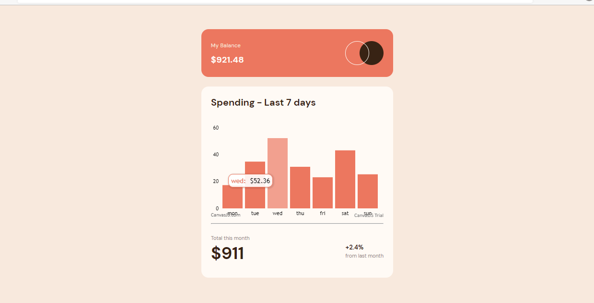

# Frontend Mentor - Expenses chart component solution

This is a solution to the [Expenses chart component challenge on Frontend Mentor](https://patkoton-expenses-chart-component.netlify.app/). 

## Table of contents

- [Overview](#overview)
  - [The challenge](#the-challenge)
  - [Screenshot](#screenshot)
  - [Links](#links)
- [My process](#my-process)
  - [Built with](#built-with)
  - [What I learned](#what-i-learned)
  - [Continued development](#continued-development)
  - [Useful resources](#useful-resources)
- [Author](#author)
- [Acknowledgments](#acknowledgments)

**Note: Delete this note and update the table of contents based on what sections you keep.**

## Overview

### The challenge

Users will be able to:

- View the bar chart and hover over the individual bars to see the correct amounts for each day
- See the current day’s bar highlighted in a different colour to the other bars
- View the optimal layout for the content depending on their device’s screen size
- See hover states for all interactive elements on the page

### Screenshot




### Links

- Solution URL: [Add solution URL here](https://github.com/patkoton/expenses-chart-component/)
- Live Site URL: [Add live site URL here](https://patkoton-expenses-chart-component.netlify.app/)

## My process

### Built with

- Semantic HTML5 markup
- CSS custom properties
- Flexbox
- [React](https://reactjs.org/) - JS library
- [Styled Components](https://styled-components.com/) - For styles

### What I learned

I really learned a lot about how to use canvasJS for Column Chart. Aside from being able to download and import it, I learned how to implement the necessary attributes that gave me what I want while building. 

```html
<!-- Some HTML code I'm proud of -->
<p className='amt'>${Math.round(sum)}</p>
```
```css
/* Proud-of-this-css that i used using styled-components */
{
  display: flex;
  justify-content: center;
  align-items: center;
}
```
```js
// proudOfThisFunc
  const summ = new Map([
                  [ "mon", 17.45  ],
                  [ "tue", 34.91  ],
                  [ "wed", 52.36  ],
                  [ "thu",  31.07  ],
                  [ "fri",  23.29  ],
                  [ "sat",  43.28  ],
                  [ "sun",  25.48  ],
 ])
  let sum = 0;

  summ.forEach(value => {
  sum += value * 4; 
});
```


### Continued development

I will like to get explanation or better clarification to why my data is rendering twice in chart with this canvasJS Docs while mapping through from the data.json file dynamically in contrast to when it is hard-coded.

Here's the screenshot to it rendering twice with it's code below


```js
componentDidMount(){
const chart = this.chart;
  fetch('data.json')
  .then(function(response) {
    return response.json();
  })
  .then(function(data) {
    for (var i = 0; i < data.length; i++) {
      dataPoints.push({
        label: data[i].label,
        y: data[i].y
      });
    }
    chart.render();
  });
}
}
```

### Useful resources

- [Canvas Charts](https://canvasjs.com) - This helped me with my column chart. I really liked this pattern and will use it going forward.

- [Stackflow](https://stackoverflow.com/) - This community helped me with solutions to problems encountered while some codes weren't working.


## Author

- Website - [Patience Orukotan](https://patportf.netlify.app/)
- Frontend Mentor - [@patkoton](https://www.frontendmentor.io/profile/patkoton)
- Twitter - [@patkoton](https://www.twitter.com/patkoton)


## Acknowledgments

I want to acknowledge [@HafeezSaidu](https://twitter.com/HafeezSaidu) for always being available to help while i'm having bugs running my code.


